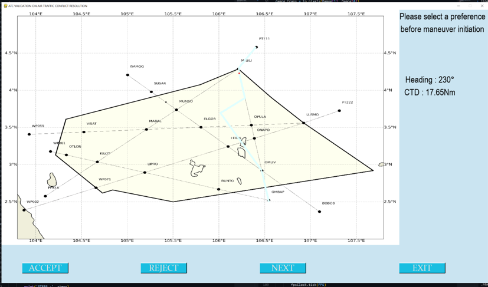

# validationInterface

Development of an interactive interface using pyGame for ATC validation.
To run the interface, run the validation_interface_main.py file. Please read the requirements.txt for the required libraries.

